# Technical Design Document — Whimsical Agent Village

**Feature:** `whimsical-agent-village`  
**Version:** 1.0  
**Status:** Draft — Awaiting Phase 1 Approval  
**Requirements Source:** `requirements.md` (same directory)

---

## Table of Contents

1. [Vertical Slice Definition](#1-vertical-slice-definition)
2. [System Architecture Overview](#2-system-architecture-overview)
3. [Component Breakdown](#3-component-breakdown)
4. [Data Models](#4-data-models)
5. [State Machine Specification](#5-state-machine-specification)
6. [IPC Contract (Tauri Commands)](#6-ipc-contract-tauri-commands)
7. [Implementation Phases](#7-implementation-phases)
8. [Requirements Triage — MVP Recommendations](#8-requirements-triage--mvp-recommendations)
9. [Traceability Matrix](#9-traceability-matrix)
10. [Risk Register](#10-risk-register)
11. [Correctness Properties for PBT](#11-correctness-properties-for-pbt)
12. [Kiro University Challenge Coverage](#12-kiro-university-challenge-coverage)

---

## 1. Vertical Slice Definition

The smallest complete end-to-end experience that proves the product works is:

> **User submits a prompt to The Builder via OpenRouter, watches the copper golem walk to the workshop bench, sees real streamed token output, and receives a Completed result — all inside the Full_Workspace window.**

### Slice Components

| Dimension | Choice | Rationale |
|-----------|--------|-----------|
| **Provider** | OpenRouter | No CLI binary required, single API key, immediate testability, streaming SSE built-in. Simplest possible auth path. |
| **Creature** | The Builder | Central character, workshop bench workstation is the "hero" visual. |
| **Task type** | Single-turn text prompt | No approval flow, no pipeline, no filesystem writes — pure completion. |
| **Display modes** | Full_Workspace only | Compact_Mode and mode transitions can be layered on once the core loop works. |
| **World** | Static background layers + one animated creature | Removes animated rain/gears from the critical path; proves canvas + sprite animation. |
| **State path covered** | idle → walking → working → celebrating → idle | Covers the happy path through World_State_Machine. |
| **Task lifecycle covered** | Queued → Assigned → Running → Completed | Happy path, no approval branch needed for OpenRouter. |

### Slice Acceptance Test

1. Launch app → Full_Workspace opens with World visible and The Builder idle at workshop bench.
2. Open Task Submission form (Ctrl+Shift+N or button), enter prompt ≥ 10 chars, select Builder, select OpenRouter, select a model, click Submit.
3. Builder transitions idle → walking → working within 3 seconds.
4. Execution output panel streams token text within 100 ms of first token.
5. On completion, Builder transitions to celebrating, then back to idle.
6. Task record with Completed status appears in task history.

Everything else is additive.

---

## 2. System Architecture Overview

```mermaid
graph TB
    subgraph "Tauri Main Process (Rust)"
        WM["Window Manager<br/>src-tauri/src/window.rs"]
        CM["Credential Manager<br/>src-tauri/src/credentials.rs"]
        DB["Persistence Service<br/>src-tauri/src/persistence.rs"]
        PM["Process Manager<br/>src-tauri/src/process_manager.rs"]
        IPC["IPC Event Bus<br/>Tauri Commands + Events"]
    end

    subgraph "React Renderer (TypeScript)"
        APP["App Root<br/>src/App.tsx"]
        STORE["App State Store<br/>src/store/appStore.ts (Zustand)"]

        subgraph "UI Layer"
            CM_UI["Compact Mode Pill<br/>src/components/CompactMode.tsx"]
            FW_UI["Full Workspace<br/>src/components/FullWorkspace.tsx"]
            TS_UI["Task Submission Form<br/>src/components/TaskForm.tsx"]
            EO_UI["Execution Output Panel<br/>src/components/ExecutionOutput.tsx"]
            SD_UI["Settings Panel<br/>src/components/Settings.tsx"]
            CD_UI["Creature Detail Panel<br/>src/components/CreatureDetail.tsx"]
            WD_UI["Workstation Detail Panel<br/>src/components/WorkstationDetail.tsx"]
        end

        subgraph "World Subsystem"
            WR["World Renderer<br/>src/world/WorldRenderer.ts"]
            WSM["World State Machine<br/>src/world/WorldStateMachine.ts"]
            ASTAR["A* Pathfinder<br/>src/world/Pathfinder.ts"]
            PS["Particle System<br/>src/world/ParticleSystem.ts"]
            SS["Sprite Sheet Manager<br/>src/world/SpriteSheetManager.ts"]
            HB["Hit Box Manager<br/>src/world/HitBoxManager.ts"]
        end

        subgraph "Agent Layer"
            ORCH["Task Orchestrator<br/>src/agents/TaskOrchestrator.ts"]
            ARH["Approval Request Handler<br/>src/agents/ApprovalHandler.ts"]
            PEX["Pipeline Executor<br/>src/agents/PipelineExecutor.ts"]
        end

        subgraph "Provider Adapters"
            PAI["Provider Adapter Interface<br/>src/adapters/types.ts"]
            ORA["OpenRouter Adapter<br/>src/adapters/OpenRouterAdapter.ts"]
            OCA["OpenAI Codex Adapter<br/>src/adapters/OpenAICodexAdapter.ts"]
            CCA["Claude Code Adapter<br/>src/adapters/ClaudeCodeAdapter.ts"]
            OCC["OpenCode Adapter<br/>src/adapters/OpenCodeAdapter.ts"]
            KCA["Kiro CLI Adapter<br/>src/adapters/KiroCLIAdapter.ts"]
        end

        subgraph "Services"
            PSVC["Persistence Service Client<br/>src/services/persistenceService.ts"]
            CSVC["Credential Service Client<br/>src/services/credentialService.ts"]
            ASVC["Audio Manager<br/>src/services/AudioManager.ts"]
            SSVC["Settings Service<br/>src/services/SettingsService.ts"]
        end
    end

    subgraph "External Processes"
        CODEX["codex subprocess"]
        CLAUDE["claude subprocess / SDK"]
        OCSRV["opencode serve subprocess"]
        KIROCLI["kiro-cli acp subprocess"]
        ORAPI["OpenRouter REST API"]
    end

    subgraph "Storage"
        SQLITE[("SQLite<br/>%APPDATA%/WhimsicalAgentVillage/data.db")]
        KEYCHAIN[("Windows Credential Manager")]
    end

    subgraph "Dev Tools"
        MCPSRV["whimsical-village-dev MCP Server<br/>tools/mcp-server/index.ts"]
    end

    IPC <-->|"invoke() / emit()"| APP
    WM --> IPC
    CM --> KEYCHAIN
    DB --> SQLITE
    PM --> CODEX
    PM --> CLAUDE
    PM --> OCSRV
    PM --> KIROCLI

    APP --> STORE
    STORE --> WR
    STORE --> ORCH
    ORCH --> ORA
    ORCH --> OCA
    ORCH --> CCA
    ORCH --> OCC
    ORCH --> KCA
    ORA -->|"HTTP SSE"| ORAPI
    OCA --> PM
    CCA --> PM
    OCC --> PM
    KCA --> PM

    ORCH --> PSVC
    PSVC -->|"tauri invoke"| DB
    CSVC -->|"tauri invoke"| CM

    MCPSRV --> SQLITE
```



### Key Architectural Decisions

| Decision | Choice | Rationale |
|----------|--------|-----------|
| State management | Zustand | Lightweight, no boilerplate, excellent TypeScript inference, works cleanly with React 19 |
| World rendering | HTML Canvas 2D | No Pixi.js/WebGL dependency, full pixel-art control at any scale via CSS transform |
| IPC pattern | `invoke()` for commands, `listen()` for streaming events | Commands are request/response; streaming tokens require push from Rust side |
| Subprocess management | Tauri `shell` plugin, `kill_children: true` | Avoids orphaned processes on Windows crash |
| WSM update loop | `setInterval` at 10 Hz, decoupled from rAF render | State updates at 100 ms cadence; renders at up to 60 fps without coupling |
| Animation loop | `requestAnimationFrame` | Browser-native, auto-throttles when hidden |
| First provider | OpenRouter | No local binary; proves streaming pipeline; unblocks UI work immediately |

---

## 3. Component Breakdown

### 3.1 Window Manager (Tauri)

**Location:** `src-tauri/src/window.rs`

**Responsibilities:**
- Manage Tauri window lifecycle (create, hide, restore, close-to-tray)
- Enforce always-on-top toggle
- Multi-monitor position memory (save/restore from Persistence_Layer)
- Emit `window-visibility-changed` event to frontend on hide/restore
- Handle unhandled panics: log to crash file, emit toast event, attempt backend restart

**Public Interface (Tauri commands):**
```rust
#[tauri::command] set_always_on_top(enabled: bool) -> Result<()>
#[tauri::command] minimize_to_tray() -> Result<()>
#[tauri::command] restore_window() -> Result<()>
#[tauri::command] get_window_position() -> Result<WindowPosition>
#[tauri::command] set_window_position(pos: WindowPosition) -> Result<()>
```

**Dependencies:** `tauri`, `tauri-plugin-notification`, `tauri-plugin-shell`

**Key Notes:** On Windows 11, tray icon requires the `tauri-plugin-tray` plugin. Panic handler is set in `main.rs` via `std::panic::set_hook`. Multi-monitor restore requires serializing monitor identity (not coordinates alone) since monitors can reorder.

---

### 3.2 App State Store (Zustand)

**Location:** `src/store/appStore.ts`

**Responsibilities:**
- Top-level application state (see Data Models §4.12 for shape)
- Slice for tasks, creatures, providers, UI mode, world state
- Actions dispatched by orchestrator, world subsystem, and UI components

**Public Interface:**
```typescript
// Slices exposed via useAppStore()
tasks: Task[]
creatures: Record<CreatureId, Creature>
providers: Record<ProviderId, ProviderStatus>
activeTaskId: string | null
displayMode: 'compact' | 'full_workspace'
worldState: WorldState
uiState: UIState  // open panels, selected entities

// Actions
addTask(task: Task): void
updateTask(id: string, patch: Partial<Task>): void
updateCreature(id: CreatureId, patch: Partial<Creature>): void
setDisplayMode(mode: DisplayMode): void
appendExecutionToken(taskId: string, token: string): void
setApprovalRequest(taskId: string, req: ApprovalRequest | null): void
```

**Dependencies:** `zustand`, Tauri event listeners (registered in `App.tsx`)

**Key Notes:** Use Zustand's `subscribeWithSelector` middleware for efficient Canvas re-renders. Immer middleware for immutable updates. Persist preferences slice to localStorage as a lightweight fallback (SQLite is the canonical store).

---

### 3.3 World Renderer (Canvas 2D)

**Location:** `src/world/WorldRenderer.ts`

**Responsibilities:**
- Manage a `<canvas>` element at 1280 × 720 logical px, CSS-scaled to container
- Layer rendering order: background → environment props → workstations → creatures → particles → UI overlays
- Drive 60 fps `requestAnimationFrame` loop in Full_Workspace; cap at 30 fps in Compact_Mode
- Pause frame updates when window is hidden (via `document.visibilitychange`)
- Render creature sprites from Sprite_Sheet frames indexed by state + frame index
- Delegate hit-box queries to `HitBoxManager`

**Public Interface:**
```typescript
class WorldRenderer {
  constructor(canvas: HTMLCanvasElement, store: AppStore)
  start(): void
  stop(): void
  setFpsCap(fps: 30 | 60): void
  getEntityAtPoint(x: number, y: number): CreatureId | WorkstationId | null
}
```

**Dependencies:** `SpriteSheetManager`, `ParticleSystem`, `HitBoxManager`, Zustand store (read-only)

**Key Notes:** Do not mutate state from the render loop — it is a pure reader. All canvas coordinates are in tile units (each tile = 16 px at 1× scale). The CSS `image-rendering: pixelated` property must be set on the canvas element to prevent bilinear interpolation of pixel art.

---

### 3.4 World State Machine

**Location:** `src/world/WorldStateMachine.ts`

**Responsibilities:**
- Maintain one finite state machine instance per Creature
- Drive ambient behavior scheduler (idle timer: 10–30 s random, weighted actions)
- Respond to Task lifecycle events dispatched from TaskOrchestrator
- Invoke A* pathfinder when initiating walking transitions
- Emit particle triggers to ParticleSystem on state entry/exit
- Update creature position (tile coordinates) as pathfinding progresses

**Public Interface:**
```typescript
class WorldStateMachine {
  constructor(creatureId: CreatureId, store: AppStore, pathfinder: Pathfinder)
  dispatch(event: WSMEvent): void
  tick(deltaMs: number): void  // called at 10 Hz by setInterval
  getState(): CreatureAnimationState
}

type WSMEvent =
  | { type: 'TASK_ASSIGNED'; taskId: string; workstationTile: Tile }
  | { type: 'TASK_COMPLETED' }
  | { type: 'TASK_FAILED' }
  | { type: 'APPROVAL_REQUESTED' }
  | { type: 'APPROVAL_GRANTED' }
  | { type: 'APPROVAL_DENIED' }
  | { type: 'IDLE_TIMER_FIRED'; behavior: AmbientBehavior }
  | { type: 'ARRIVED_AT_WORKSTATION' }
  | { type: 'PATH_BLOCKED' }
```

**Dependencies:** `Pathfinder`, `ParticleSystem`, Zustand store (write: creature state, position)

**Key Notes:** The WSM update interval is 100 ms (10 Hz), decoupled from the 60 fps render loop. Ambient behavior weights: walk 40%, stretch 20%, sit 20%, sleep 20%. Collision detection (Req 4.11–12) is handled in the walking sub-state: before each tile step, check if target tile is occupied.

---

### 3.5 A* Pathfinder

**Location:** `src/world/Pathfinder.ts`

**Responsibilities:**
- Compute shortest path on an 80 × 45 tile walkability grid
- Return array of `Tile` coordinates from start to target (inclusive)
- Return empty array if start === target or either tile is unwalkable
- Support dynamic obstacle updates (creature positions)

**Public Interface:**
```typescript
class Pathfinder {
  constructor(walkabilityGrid: boolean[][])  // true = walkable
  findPath(start: Tile, end: Tile, dynamicObstacles?: Tile[]): Tile[]
  updateGrid(grid: boolean[][]): void
}
```

**Dependencies:** None (pure computation)

**Key Notes:** Use binary heap priority queue for O(n log n) performance. Manhattan distance heuristic (adequate for grid, no diagonal movement). Grid is 80 × 45 = 3,600 tiles — well within instant computation budget. The walkability grid is defined in `src/world/worldLayout.ts` as a static constant derived from the visual World design.

---

### 3.6 Particle System

**Location:** `src/world/ParticleSystem.ts`

**Responsibilities:**
- Manage a pool of `Particle` objects (max 64 active particles)
- Emit particle bursts on trigger events (celebrating, error, working, sleeping)
- Update particle positions/alphas each frame
- Render particles onto the canvas overlay layer

**Public Interface:**
```typescript
class ParticleSystem {
  update(deltaMs: number): void
  render(ctx: CanvasRenderingContext2D): void
  emit(effect: ParticleEffect): void
}

type ParticleEffect =
  | { type: 'ZZZ'; origin: Point; rate: number }       // sleeping
  | { type: 'SPARKLE'; origin: Point; count: 8 | 12 }  // celebrating
  | { type: 'ERROR'; origin: Point }                    // error_reaction
  | { type: 'THINKING'; origin: Point }                 // working
```

**Dependencies:** None

**Key Notes:** ZZZ effect: 1 particle/2 s, lifetime = 2 s, rises 24 px then fades. Sparkle burst: 8–12 particles, radial velocity, lifetime = 1.5 s. Error "!": single red glyph, lifetime = 2 s, no movement. Thinking halo: 3–5 particles, circular orbit, lifetime = 1 s, emission rate = 1/s.

---

### 3.7 Sprite Sheet Manager

**Location:** `src/world/SpriteSheetManager.ts`

**Responsibilities:**
- Load and cache PNG sprite sheets from Tauri asset protocol
- Index frames by (creatureId, animationState, frameIndex)
- Return `ImageBitmap` slices for rendering
- Handle sprite sheet metadata (frame size, row-per-state layout)

**Public Interface:**
```typescript
class SpriteSheetManager {
  async load(creatureId: CreatureId): Promise<void>
  getFrame(creatureId: CreatureId, state: CreatureAnimationState, frameIndex: number): ImageBitmap
  getFrameCount(creatureId: CreatureId, state: CreatureAnimationState): number
}
```

**Sprite Sheet Layout Convention:**
- One PNG per creature: `assets/sprites/{creature_id}.png`
- Each row = one animation state (order: idle, walking, working, sleeping, celebrating, error_reaction, waiting, stretching)
- Each column = one frame (minimum 4 frames per row)
- Frame size: minimum 48 × 48 px

---

### 3.8 Hit Box Manager

**Location:** `src/world/HitBoxManager.ts`

**Responsibilities:**
- Maintain rectangle hit-boxes for all Creatures and Workstations
- Update Creature hit-boxes on every position change
- Expose point-in-box query for click routing

**Public Interface:**
```typescript
class HitBoxManager {
  updateCreatureBox(id: CreatureId, tileBounds: Rect): void
  getEntityAtPoint(canvasX: number, canvasY: number): HitTarget | null
}

type HitTarget =
  | { kind: 'creature'; id: CreatureId }
  | { kind: 'workstation'; id: WorkstationId }
```

---

### 3.9 Provider Adapter Interface

**Location:** `src/adapters/types.ts`

**Responsibilities:**
- Define the common `ProviderAdapter` interface all 5 adapters implement
- Define all shared types: `ProviderInfo`, `AuthResult`, `ModelInfo`, `SessionHandle`, `ExecutionEvent`, `Credentials`

**Public Interface:**
```typescript
interface ProviderAdapter {
  readonly providerId: ProviderId
  discover(): Promise<ProviderInfo>
  authenticate(credentials: Credentials): Promise<AuthResult>
  listModels(): Promise<ModelInfo[]>
  startSession(task: Task): Promise<SessionHandle>
  streamEvents(session: SessionHandle): AsyncIterable<ExecutionEvent>
  sendApproval(session: SessionHandle, approved: boolean): Promise<void>
  cancelSession(session: SessionHandle): Promise<void>
}
```

**Key Notes:** All 5 adapter files are in `src/adapters/`. No cross-adapter imports. Orchestrator imports only through the interface. Each adapter is instantiated once at app startup and held in a registry (`src/adapters/adapterRegistry.ts`).

---

### 3.10 OpenRouter Adapter

**Location:** `src/adapters/OpenRouterAdapter.ts`

**Responsibilities:**
- Check for `OPENROUTER_API_KEY` in Credential_Store (via IPC)
- Fetch and cache model list from `https://openrouter.ai/api/v1/models` (1-hour TTL)
- POST to `/v1/chat/completions` with `stream: true`
- Parse SSE `data:` lines into `token` ExecutionEvents
- Manage AbortController for cancellation
- Set required `HTTP-Referer` and `X-Title` headers

**Key Notes:** No subprocess required. `startSession()` returns a handle containing the AbortController. `streamEvents()` is an async generator that yields token events and a terminal `completion` event. No tool_call or approval events — OpenRouter is text-only (Req 12.8).

---

### 3.11 OpenAI Codex Adapter

**Location:** `src/adapters/OpenAICodexAdapter.ts`

**Responsibilities:**
- Discover `codex` binary in PATH via Tauri IPC `check_binary`
- Spawn `codex --mcp-server` subprocess via Tauri `process_manager`
- Communicate over subprocess stdio using MCP server protocol
- Translate Codex MCP events → normalized `ExecutionEvent`
- Surface sandbox policy gates as `approval_request` events
- SIGTERM on cancel, SIGKILL after 3 s if still running

**Key Notes:** Subprocess lifecycle managed via Tauri IPC — frontend sends `start_codex_session` command, Rust spawns the process and relays events as Tauri `emit()` calls. All subprocess I/O stays in Rust.

---

### 3.12 Claude Code Adapter

**Location:** `src/adapters/ClaudeCodeAdapter.ts`

**Responsibilities:**
- Discover `claude` binary and `ANTHROPIC_API_KEY`
- Primary path: use `@anthropic-ai/claude-code` SDK `query()` with `includePartialMessages: true`
- Fallback path: spawn `claude -p "<prompt>" --output-format stream-json` as subprocess
- Map `assistant_message` stream events → `token` ExecutionEvents
- Map `tool_use` stream events → `tool_call` ExecutionEvents
- Emit `approval_request` on permission requests
- Call SDK session abort on cancel

---

### 3.13 OpenCode Adapter

**Location:** `src/adapters/OpenCodeAdapter.ts`

**Responsibilities:**
- Discover `opencode` binary
- Spawn `opencode serve` subprocess; parse stdout for port number
- Wait up to 5 s for HTTP health check on the discovered port
- Use `@opencode-ai/sdk` to create sessions and subscribe to SSE
- Translate server SSE events → normalized ExecutionEvents
- Abort SDK session + SIGTERM subprocess on cancel
- Cleanly terminate subprocess on adapter shutdown

**Key Notes:** Port discovery must parse subprocess stdout, not assume a fixed port (Appendix C risk #3). Use a regex on startup output to extract `Listening on port XXXX`.

---

### 3.14 Kiro CLI Adapter

**Location:** `src/adapters/KiroCLIAdapter.ts`

**Responsibilities:**
- Discover `kiro-cli` binary (including WSL path fallback per Appendix C)
- Spawn `kiro-cli acp` subprocess, establish JSON-RPC 2.0 over stdin/stdout
- Perform ACP `initialize` handshake within 3 s
- Send `session/create` + `session/prompt` for task submission
- Map `agent/message` → `token` ExecutionEvents
- Map `tool/result` → `tool_call` ExecutionEvents
- Send `session/cancel` on cancellation; SIGTERM after 2 s
- Version-negotiate: if version ≥ 1.23, support Crew pipeline dispatch

**Key Notes:** All JSON-RPC communication goes through Tauri IPC process bridge. The adapter on the TypeScript side receives deserialized ACP messages as Tauri events.

---

### 3.15 Task Orchestrator

**Location:** `src/agents/TaskOrchestrator.ts`

**Responsibilities:**
- Accept task submissions from UI; assign UUID, set Queued status, persist
- Route tasks to the correct Creature's queue
- Notify WorldStateMachine of task assignment (triggers walking)
- Start execution when Creature reaches Workstation (`ARRIVED_AT_WORKSTATION` event)
- Drive execution: call `startSession()`, iterate `streamEvents()`, dispatch events to store
- Enforce 10-minute execution timeout (Req 6.15)
- Handle approval_request events: pause iteration, route to ApprovalHandler
- On completion/failure: persist result, notify WSM
- On app restart: detect orphaned Running tasks, mark Failed (Req 6.16)

**Public Interface:**
```typescript
class TaskOrchestrator {
  async submitTask(params: TaskSubmissionParams): Promise<string>  // returns taskId
  async cancelTask(taskId: string): Promise<void>
  onCreatureArrivedAtWorkstation(creatureId: CreatureId): void
  async approveTask(taskId: string, approved: boolean): Promise<void>
}
```

**Dependencies:** All 5 adapters (via registry), PersistenceService, Zustand store, WorldStateMachine, ApprovalHandler

---

### 3.16 Approval Request Handler

**Location:** `src/agents/ApprovalHandler.ts`

**Responsibilities:**
- Receive `approval_request` ExecutionEvents from TaskOrchestrator
- Update Zustand store with pending approval (surfaces Approve/Deny buttons in UI)
- Wait for user decision (Promise-based)
- Route decision back to TaskOrchestrator within 500 ms of user action

**Public Interface:**
```typescript
class ApprovalHandler {
  async waitForApproval(request: ApprovalRequest): Promise<boolean>
  resolveApproval(taskId: string, approved: boolean): void
}
```

---

### 3.17 Pipeline Executor

**Location:** `src/agents/PipelineExecutor.ts`

**Responsibilities:**
- Accept a Pipeline definition (ordered list of up to 5 TaskDefinitions)
- Execute tasks sequentially, waiting for Completed before starting next
- Substitute `{{task_N_output}}` placeholders with previous task output (truncated to model token budget)
- On any task Failure: cancel remaining tasks, emit pipeline failure notification
- Update store with pipeline progress state

**Public Interface:**
```typescript
class PipelineExecutor {
  async executePipeline(pipeline: Pipeline): Promise<void>
  cancelPipeline(pipelineId: string): void
}
```

---

### 3.18 Persistence Service

**Location:**
- Rust: `src-tauri/src/persistence.rs`
- TypeScript client: `src/services/persistenceService.ts`

**Responsibilities:**
- Initialize SQLite at `%APPDATA%\WhimsicalAgentVillage\data.db` with WAL mode
- Run embedded migrations at startup (`src-tauri/migrations/`)
- Provide CRUD for Task, Creature, ProviderSettings, UserPreferences entities
- Export task history as JSON
- "Clear history older than N days" vacuum operation

**TypeScript Client:**
```typescript
const persistenceService = {
  async saveTask(task: Task): Promise<void>
  async updateTask(id: string, patch: Partial<Task>): Promise<void>
  async getTasks(filter?: TaskFilter): Promise<Task[]>
  async saveCreature(creature: Creature): Promise<void>
  async getCreatures(): Promise<Creature[]>
  async savePreference(key: string, value: string): Promise<void>
  async getPreference(key: string): Promise<string | null>
  async exportHistory(outputPath: string): Promise<void>
  async clearHistoryOlderThan(days: number): Promise<void>
}
```

**Migration files:** `src-tauri/migrations/001_initial_schema.sql`, `002_add_token_counts.sql`, etc.

---

### 3.19 Credential Manager

**Location:**
- Rust: `src-tauri/src/credentials.rs` (wraps `tauri-plugin-keyring`)
- TypeScript client: `src/services/credentialService.ts`

**Responsibilities:**
- Store/retrieve credentials from Windows Credential Manager
- Never log credential values; replace with `[REDACTED]`
- Show confirmation modal before write (Req 13.7)
- Return masked display string (all but last 4 chars as ●)

**TypeScript Client:**
```typescript
const credentialService = {
  async saveCredential(provider: ProviderId, value: string): Promise<void>
  async getCredential(provider: ProviderId): Promise<string | null>
  async deleteCredential(provider: ProviderId): Promise<void>
  getMaskedDisplay(provider: ProviderId): Promise<string>  // "●●●●●●●●abcd"
}
```

---

### 3.20 Audio Manager

**Location:** `src/services/AudioManager.ts`

**Responsibilities:**
- Initialize Web Audio API `AudioContext`
- Load bundled audio assets (footsteps, typing, chime, low-tone, rain) on first enable
- Play/stop event-driven sounds and ambient loops per Req 16.2
- Fade to 0% on window hide; resume on restore
- Expose per-category volume controls (ambient, creature, event)

**Key Notes:** All audio disabled by default on first launch (Req 16.1). Assets stored in `src-tauri/assets/audio/`. Lazy-loaded on first enable to avoid unnecessary startup I/O.

---

### 3.21 Settings Service

**Location:** `src/services/SettingsService.ts`

**Responsibilities:**
- Load UserPreferences from PersistenceService at startup
- Provide reactive settings access via Zustand slice
- Apply settings changes immediately (theme, audio, FPS cap)
- Identify settings that require window re-init (always-on-top, transparency) and trigger accordingly

---

### 3.22 MCP Dev Server

**Location:** `tools/mcp-server/index.ts`

**Responsibilities:**
- Expose MCP tools: `list_creatures()`, `list_tasks(status?)`, `validate_adapter(adapter_name)`
- Read from dev SQLite database
- Execute `tools/validate-adapter.ts` script for `validate_adapter`
- Return structured JSON responses

**Key Notes:** Standard MCP SDK (`@modelcontextprotocol/sdk`). Runs as `node tools/mcp-server/index.ts`. Configuration in `.kiro/mcp.json`.

---

### 3.23 PBT Test Suite

**Location:** `src/__tests__/pbt/`

**Files:**
- `worldStateMachine.pbt.test.ts` — Req 18.1
- `taskLifecycle.pbt.test.ts` — Req 18.2
- `persistenceRoundTrip.pbt.test.ts` — Req 18.3
- `concurrentEvents.pbt.test.ts` — Req 18.4
- `adapterContract.pbt.test.ts` — Req 18.5
- `pathfinder.pbt.test.ts` — Req 18.6

**Framework:** `fast-check` with `vitest`

---

## 4. Data Models

```typescript
// ─── Core Identifiers ─────────────────────────────────────────────────────────

type CreatureId = 'builder' | 'researcher' | 'debugger'
type WorkstationId = 'workshop_bench' | 'library_desk' | 'examination_table'
type ProviderId = 'openai_codex' | 'claude_code' | 'opencode' | 'kiro_cli' | 'openrouter'

// ─── Tile / World Geometry ────────────────────────────────────────────────────

interface Tile {
  x: number  // 0–79
  y: number  // 0–44
}

interface Point {
  x: number  // canvas px
  y: number  // canvas px
}

interface Rect {
  x: number
  y: number
  width: number
  height: number
}

// ─── Task ─────────────────────────────────────────────────────────────────────

type TaskStatus =
  | 'Queued'
  | 'Assigned'
  | 'Running'
  | 'Waiting_For_Approval'
  | 'Completed'
  | 'Failed'
  | 'Cancelled'

interface Task {
  id: string                    // UUID v4
  title: string                 // First 60 chars of prompt
  prompt: string                // 10–4000 chars
  status: TaskStatus
  creatureId: CreatureId
  providerId: ProviderId
  modelId: string
  pipelineId: string | null     // null if standalone
  pipelineStep: number | null   // 0-based index in pipeline
  createdAt: number             // Unix ms
  assignedAt: number | null
  startedAt: number | null
  completedAt: number | null
  executionOutput: string       // Accumulated token text
  errorDetails: string | null
  inputTokenCount: number | null
  outputTokenCount: number | null
  totalTokenCount: number | null
  approvalRequest: ApprovalRequest | null
}

// ─── Creature ─────────────────────────────────────────────────────────────────

type CreatureAnimationState =
  | 'idle'
  | 'walking'
  | 'working'
  | 'sleeping'
  | 'celebrating'
  | 'error_reaction'
  | 'waiting'
  | 'stretching'

interface Creature {
  id: CreatureId
  name: string                       // 1–32 chars
  animationState: CreatureAnimationState
  position: Tile                     // Current tile
  targetPosition: Tile | null        // Walking destination
  currentPath: Tile[]                // Remaining A* path
  activeTaskId: string | null
  defaultProviderId: ProviderId
  defaultModelId: string
  frameIndex: number                 // Current sprite frame (0-based)
  frameTimer: number                 // ms since last frame advance
  idleTimer: number                  // ms until next ambient behavior
  blockTimer: number                 // ms waiting for blocked path (0 = not blocked)
}

// ─── Provider ─────────────────────────────────────────────────────────────────

interface ProviderInfo {
  providerId: ProviderId
  available: boolean
  unavailableReason: string | null   // Binary name, error summary, etc.
  version: string | null
}

interface AuthResult {
  success: boolean
  errorMessage: string | null
}

interface ModelInfo {
  modelId: string
  displayName: string
  contextWindow: number | null
  capabilities: string[]             // 'coding' | 'research' | 'completion' etc.
  provider: string                   // Underlying provider (for OpenCode/OpenRouter)
}

interface Credentials {
  apiKey?: string
  sessionToken?: string
  // Provider-specific fields; never logged
}

// ─── Session Handle ───────────────────────────────────────────────────────────

interface SessionHandle {
  sessionId: string
  providerId: ProviderId
  processId?: number                 // For subprocess-based providers
  abortController?: AbortController  // For HTTP-based providers (OpenRouter)
  startedAt: number
}

// ─── Execution Events (discriminated union) ───────────────────────────────────

interface BaseEvent {
  sessionId: string
  timestamp: number
}

interface TokenEvent extends BaseEvent {
  type: 'token'
  text: string
}

interface ToolCallEvent extends BaseEvent {
  type: 'tool_call'
  toolName: string
  arguments: Record<string, unknown>
  callId: string
}

interface FileWriteEvent extends BaseEvent {
  type: 'file_write'
  filePath: string
  operation: 'create' | 'modify' | 'delete'
}

interface ApprovalRequestEvent extends BaseEvent {
  type: 'approval_request'
  actionDescription: string
  target: string                     // File path or shell command
  proposedCommand: string | null
}

interface ErrorEvent extends BaseEvent {
  type: 'error'
  message: string
  code: string | null
}

interface CompletionEvent extends BaseEvent {
  type: 'completion'
  inputTokens: number | null
  outputTokens: number | null
  totalTokens: number | null
  stopReason: string
}

type ExecutionEvent =
  | TokenEvent
  | ToolCallEvent
  | FileWriteEvent
  | ApprovalRequestEvent
  | ErrorEvent
  | CompletionEvent

// ─── Approval Request ─────────────────────────────────────────────────────────

interface ApprovalRequest {
  requestId: string
  taskId: string
  actionDescription: string
  target: string
  proposedCommand: string | null
  requestedAt: number
}

// ─── Pipeline ─────────────────────────────────────────────────────────────────

type PipelineStatus = 'Pending' | 'Running' | 'Completed' | 'Failed' | 'Cancelled'

interface TaskDefinition {
  promptTemplate: string             // May contain {{task_N_output}} tokens
  creatureId: CreatureId
  providerId: ProviderId
  modelId: string
}

interface Pipeline {
  id: string                         // UUID v4
  name: string
  steps: TaskDefinition[]            // 1–5 items
  taskIds: string[]                  // Populated as tasks are created
  status: PipelineStatus
  failedStep: number | null
  createdAt: number
}

// ─── World State ─────────────────────────────────────────────────────────────

interface WorldState {
  walkabilityGrid: boolean[][]       // [y][x], true = walkable, 45 rows × 80 cols
  creatures: Record<CreatureId, Creature>
  workstations: Record<WorkstationId, WorkstationState>
  particles: Particle[]
  ambientAnimFrame: number           // Global frame counter for env animations
}

interface WorkstationState {
  id: WorkstationId
  tile: Tile
  occupiedByCreature: CreatureId | null
  activeTaskId: string | null
}

// ─── Particle ─────────────────────────────────────────────────────────────────

interface Particle {
  id: string
  type: 'ZZZ' | 'SPARKLE' | 'ERROR' | 'THINKING'
  origin: Point
  position: Point
  velocity: Point
  alpha: number                      // 0–1
  lifetime: number                   // ms total
  age: number                        // ms elapsed
  glyph?: string                     // For ZZZ / ERROR text particles
  color: string                      // CSS color string
}

// ─── Sprite Sheet ─────────────────────────────────────────────────────────────

interface SpriteSheetMetadata {
  creatureId: CreatureId
  frameWidth: number                 // px (minimum 48)
  frameHeight: number                // px (minimum 48)
  states: Record<CreatureAnimationState, SpriteRowDef>
}

interface SpriteRowDef {
  row: number                        // 0-based row index in sheet
  frameCount: number                 // Number of columns (minimum 4)
  frameDurationMs: number            // Duration per frame
}

// ─── User Preferences ─────────────────────────────────────────────────────────

interface UserPreferences {
  alwaysOnTop: boolean
  startInCompactMode: boolean
  reducedMotion: boolean
  colorScheme: 'dark' | 'cozy'
  closeToQuit: boolean
  desktopNotifications: boolean
  audioEnabled: boolean
  ambientVolume: number              // 0–1
  creatureVolume: number             // 0–1
  eventVolume: number                // 0–1
  defaultProjectDirectory: string
  taskHistoryRetentionDays: number   // default 90
  lastWindowMonitor: string | null   // Monitor ID
  lastWindowX: number | null
  lastWindowY: number | null
}

// ─── App State (Zustand top-level shape) ──────────────────────────────────────

interface AppState {
  // Data
  tasks: Record<string, Task>
  taskIds: string[]                  // Ordered list
  creatures: Record<CreatureId, Creature>
  providers: Record<ProviderId, ProviderInfo>
  providerModels: Record<ProviderId, ModelInfo[]>
  pipelines: Record<string, Pipeline>
  preferences: UserPreferences

  // World
  worldState: WorldState

  // UI
  displayMode: 'compact' | 'full_workspace'
  selectedEntity: HitTarget | null   // What's selected in World
  openPanel: 'task_form' | 'creature_detail' | 'workstation_detail' | 'settings' | null
  activeTaskOutputs: Record<string, string>  // taskId → accumulated text

  // Actions (omitted from this type, defined on store)
}

// ─── Provider Status ──────────────────────────────────────────────────────────

interface ProviderStatus extends ProviderInfo {
  authenticated: boolean
  lastDiscoveredAt: number | null
  cachedModels: ModelInfo[]
}
```

---

## 5. State Machine Specification

### 5.1 World_State_Machine

Each Creature has an independent instance. The machine runs at 10 Hz via `setInterval`.

#### States and Entry Actions

| State | Entry Action | Notes |
|-------|-------------|-------|
| `idle` | Start idle timer (random 10–30 s); stop walking | Default resting state |
| `walking` | Compute A* path to target; start footstep audio | Sub-state tracks path progress |
| `working` | Start thinking-halo particle emission; start typing audio | Active task execution |
| `sleeping` | Start ZZZ particle emission (after 10 s in sleeping); start sleep timer 5–8 s | Ambient; transitions back to idle on timer |
| `celebrating` | Emit sparkle burst (8–12 particles); play chime audio | 1.5 s duration, then idle |
| `error_reaction` | Emit red "!" particle for 2 s; play low-tone audio | 2 s duration, then idle |
| `waiting` | Halt working animation at last frame; hide thinking halo | Approval pending |
| `stretching` | Play stretch animation once (no loop); 2 s duration | Ambient; transitions back to idle |

#### Transition Table

| Current State | Event | Guard | Next State | Action |
|--------------|-------|-------|------------|--------|
| `idle` | `TASK_ASSIGNED` | — | `walking` | Set target = workstation tile |
| `idle` | `IDLE_TIMER_FIRED` (walk) | No queued task | `walking` | Set target = random walkable tile |
| `idle` | `IDLE_TIMER_FIRED` (stretch) | No queued task | `stretching` | — |
| `idle` | `IDLE_TIMER_FIRED` (sleep) | No queued task | `sleeping` | — |
| `idle` | `IDLE_TIMER_FIRED` (sit) | No queued task | `idle` | Move to nearby prop tile (visual only) |
| `walking` | `ARRIVED_AT_WORKSTATION` | Has queued task | `working` | Notify orchestrator |
| `walking` | `ARRIVED_AT_WORKSTATION` | No queued task | `idle` | — |
| `walking` | `PATH_BLOCKED` | Block timer < 3 s | `walking` | Increment block timer, wait |
| `walking` | `PATH_BLOCKED` | Block timer ≥ 3 s | `walking` | Recalculate path |
| `walking` | `TASK_ASSIGNED` | Already walking to workstation | `walking` | No change |
| `sleeping` | `TASK_ASSIGNED` | — | `walking` | Wake immediately |
| `sleeping` | Sleep timer expires | — | `idle` | Reset sleep timer |
| `sleeping` | `IDLE_TIMER_FIRED` | — | `sleeping` | (ignored, already sleeping) |
| `stretching` | Stretch animation completes | — | `idle` | — |
| `working` | `TASK_COMPLETED` | — | `celebrating` | — |
| `working` | `TASK_FAILED` | — | `error_reaction` | — |
| `working` | `APPROVAL_REQUESTED` | — | `waiting` | — |
| `waiting` | `APPROVAL_GRANTED` | — | `working` | Resume working anim |
| `waiting` | `APPROVAL_DENIED` | — | `error_reaction` | — |
| `waiting` | Approval timeout (Req 6.9) | — | `error_reaction` | Mark task Failed |
| `celebrating` | Animation complete (1.5 s) | — | `idle` | — |
| `error_reaction` | Animation complete (2 s) | — | `idle` | — |

#### Invariants
- A creature can only be in one state at a time.
- `working`, `waiting`, `celebrating`, `error_reaction` require an `activeTaskId`.
- No two creatures share a tile (enforced in walking sub-state).

---

### 5.2 Task_Lifecycle

Managed by `TaskOrchestrator`.

#### State Transition Table

| Current Status | Event | Guard | Next Status | Action |
|---------------|-------|-------|-------------|--------|
| `Queued` | Creature assigned | Target creature idle/sleeping | `Queued` | Trigger WSM walking |
| `Queued` | Creature arrives at workstation | Creature just arrived | `Assigned` → `Running` | Start session within 200 ms |
| `Running` | `token` event received | — | `Running` | Append to output |
| `Running` | `tool_call` event received | — | `Running` | Render in output panel |
| `Running` | `file_write` event received | — | `Running` | Render in output panel |
| `Running` | `approval_request` event | — | `Waiting_For_Approval` | Show approval UI |
| `Running` | `completion` event | — | `Completed` | Persist, notify WSM |
| `Running` | `error` event | — | `Failed` | Persist, notify WSM |
| `Running` | 10-minute timeout | No events for 10 min | `Failed` | reason = "Execution timeout" |
| `Running` | User cancel | — | `Cancelled` | Send cancel to adapter |
| `Waiting_For_Approval` | User approves | — | `Running` | Notify adapter |
| `Waiting_For_Approval` | User denies | — | `Failed` | reason = "Approval denied by user" |
| `Waiting_For_Approval` | User cancel | — | `Cancelled` | Send cancel to adapter |
| `Completed` | (terminal) | — | — | No further transitions |
| `Failed` | (terminal) | — | — | No further transitions |
| `Cancelled` | (terminal) | — | — | No further transitions |

#### Invalid Transitions (Forbidden — PBT Property 2)
- `Completed → Running`
- `Completed → Queued`
- `Failed → Running`
- `Failed → Queued`
- `Cancelled → Running`
- `Cancelled → Queued`
- Any backward transition to `Assigned` from terminal states

#### Timeout Triggers
- **Execution timeout**: 10 minutes from `Running` entry with no `ExecutionEvent` received
- **Restart detection**: On app launch, any task with status `Running` or `Waiting_For_Approval` is immediately marked `Failed` with reason `"Application shutdown during execution"`
- **Cancel acknowledgement timeout**: 2 seconds from cancel signal; if no adapter acknowledgement, force `Cancelled`

---

## 6. IPC Contract (Tauri Commands)

All TypeScript calls use `import { invoke } from '@tauri-apps/api/core'`.  
All Rust streaming events use `import { listen } from '@tauri-apps/api/event'`.

### Commands (Request/Response)

| Command | Parameters | Return Type | Rust Handler | Error Conditions |
|---------|-----------|-------------|--------------|-----------------|
| `set_always_on_top` | `{ enabled: boolean }` | `void` | `window::set_always_on_top` | Window not found |
| `minimize_to_tray` | — | `void` | `window::minimize_to_tray` | Tray not initialized |
| `restore_window` | — | `void` | `window::restore_window` | — |
| `get_window_position` | — | `WindowPosition` | `window::get_position` | — |
| `save_credential` | `{ provider: string, value: string }` | `void` | `credentials::save` | Keychain unavailable, Write error |
| `get_credential` | `{ provider: string }` | `string \| null` | `credentials::get` | Keychain unavailable |
| `delete_credential` | `{ provider: string }` | `void` | `credentials::delete` | Not found |
| `db_execute` | `{ query: string, params: unknown[] }` | `void` | `persistence::execute` | SQL error, DB locked |
| `db_select` | `{ query: string, params: unknown[] }` | `unknown[]` | `persistence::select` | SQL error |
| `check_binary` | `{ name: string }` | `{ found: boolean, path: string \| null, version: string \| null }` | `process_manager::check_binary` | — |
| `spawn_provider_process` | `{ provider: ProviderId, args: string[], env: Record<string,string> }` | `{ processId: number }` | `process_manager::spawn` | Binary not found, Spawn error |
| `kill_provider_process` | `{ processId: number, signal: 'SIGTERM' \| 'SIGKILL' }` | `void` | `process_manager::kill` | Process not found |
| `send_process_stdin` | `{ processId: number, data: string }` | `void` | `process_manager::write_stdin` | Process dead, Broken pipe |
| `get_app_data_dir` | — | `string` | `paths::app_data_dir` | — |
| `show_save_dialog` | `{ defaultName: string }` | `string \| null` | `dialogs::save_file` | User cancelled |
| `send_os_notification` | `{ title: string, body: string }` | `void` | `notifications::send` | Permission denied |

### Streaming Events (Rust → TypeScript via `emit`)

| Event Name | Payload Type | Description |
|------------|-------------|-------------|
| `execution-event` | `{ taskId: string, event: ExecutionEvent }` | Streamed token/tool/approval events from provider |
| `process-stdout` | `{ processId: number, line: string }` | Raw stdout line from subprocess (for port discovery, etc.) |
| `process-stderr` | `{ processId: number, line: string }` | Subprocess stderr |
| `process-exited` | `{ processId: number, exitCode: number }` | Subprocess exit notification |
| `window-visibility-changed` | `{ visible: boolean }` | Window shown/hidden |
| `backend-error` | `{ message: string, context: string }` | Non-fatal backend error |

### Event Registration Pattern
```typescript
// In TaskOrchestrator constructor:
const unlisten = await listen<{ taskId: string; event: ExecutionEvent }>(
  'execution-event',
  ({ payload }) => this.handleExecutionEvent(payload.taskId, payload.event)
)
// Store unlisten() for cleanup
```

---

## 7. Implementation Phases

### Phase 0 — Foundation (Week 1)

**Goal:** Runnable skeleton with tooling, CI, and Kiro artifacts in place.

#### Deliverables
- [ ] `pnpm create tauri-app` with React 19 + TypeScript template
- [ ] Configure ESLint (`@typescript-eslint/recommended`), Prettier, Vitest, `fast-check`
- [ ] Configure `tauri-plugin-sql`, `tauri-plugin-keyring`, `tauri-plugin-shell`, `tauri-plugin-notification`, `tauri-plugin-tray`
- [ ] SQLite schema and initial migration (`001_initial_schema.sql`)
- [ ] Zustand store skeleton with TypeScript types (all interfaces from §4)
- [ ] All 5 Kiro steering documents in `.kiro/steering/`
- [ ] All 4 Kiro hooks in `.kiro/hooks/`
- [ ] `.kiro/mcp.json` with filesystem + sqlite + whimsical-village-dev entries
- [ ] MCP dev server scaffold in `tools/mcp-server/`
- [ ] All 3 custom agent definitions in `.kiro/agents/`
- [ ] `docs/decisions/` directory with first ADR (technology choices)
- [ ] Provider audit: run all 5 binaries on target Windows machine, document available versions

#### Requirements Addressed
- Req 19 (Steering docs), Req 20 (Hooks), Req 21 (MCP), Req 22 (Custom agents), Req 14.1–2 (DB schema)

#### Dependencies
- None (starting point)

#### Risks
- Tauri v2 plugin API changes between RC and stable
- `tauri-plugin-keyring` Windows Credential Manager integration requires correct manifest permissions

#### Completion Criteria
- `pnpm tauri dev` opens a blank window
- `pnpm test` runs (zero tests pass, no infrastructure errors)
- All `.kiro/` artifacts present and valid JSON/Markdown
- SQLite file created at correct path on first launch

---

### Phase 1 — Application Shell + Compact Mode (Week 2)

**Goal:** Stable window with Compact_Mode pill, system tray, credential entry, and settings skeleton.

#### Deliverables
- [ ] `WindowManager` (Rust): always-on-top, close-to-tray, multi-monitor position restore
- [ ] `CredentialManager` (Rust + TS client): save/retrieve from Windows Credential Manager
- [ ] `PersistenceService` (Rust + TS client): CRUD for Tasks, Creatures, UserPreferences
- [ ] `SettingsService` (TS): load preferences on startup, reactive Zustand slice
- [ ] Compact_Mode pill component (320 × 64 px, floating, draggable)
- [ ] Full_Workspace layout scaffold (panels empty, navigation control)
- [ ] Settings panel: Providers section (credential entry, masked display, Test Connection button), Appearance section (always-on-top, start in compact)
- [ ] OS notification on task status change
- [ ] Window visibility event → CPU throttle hook

#### Requirements Addressed
- Req 1 (1–10), Req 2.1–2, Req 2.5–6, Req 13, Req 14, Req 17

#### Dependencies
- Phase 0 complete

#### Risks
- Windows tray icon on Windows 11 enterprise environments (see Appendix C Risk #5)
- `tauri-plugin-keyring` credential confirmation modal UX timing

#### Completion Criteria
- App launches, shows Compact_Mode pill within 3 s
- API key can be entered, masked, saved to Windows Credential Manager, retrieved
- Close button minimizes to tray; tray restore works
- Preferences persist across restarts
- CPU < 2% when window minimized (measured with Task Manager)

---

### Phase 2 — Living World (Weeks 3–4)

**Goal:** Animated World with all three Creatures doing ambient behaviors, click interaction working.

#### Deliverables
- [ ] Canvas 2D World renderer (1280 × 720, CSS-scaled, layered rendering)
- [ ] Static background layers: rainy window (static), workshop floor, bookshelf, lantern (static glow), props
- [ ] Three Workstations rendered at correct tile positions
- [ ] Placeholder sprite sheets for all 3 Creatures (48 × 48 px, 8 states × 4 frames minimum)
- [ ] `SpriteSheetManager` loading and caching
- [ ] `WorldStateMachine` with full transition table (§5.1)
- [ ] `Pathfinder` (A*) with walkability grid for the World layout
- [ ] `ParticleSystem` with ZZZ, sparkle, error, thinking effects
- [ ] `HitBoxManager` for click routing
- [ ] Creature/Workstation detail panels (populated from store, no real task data yet)
- [ ] Click → empty space closes panels
- [ ] 60 fps in Full_Workspace; 30 fps in Compact_Mode
- [ ] `requestAnimationFrame` pause on `visibilitychange`
- [ ] ZZZ loop after 10 s sleeping (Req 3.7)
- [ ] Ambient behavior scheduler (40/20/20/20 weighted random)

#### Requirements Addressed
- Req 3 (1–7), Req 4 (1–13), Req 5 (1–6), Req 2.7

#### Dependencies
- Phase 1 complete (Zustand store, window management)

#### Risks
- Placeholder sprites may look poor; recommend commissioning or AI-generating final sprites before Phase 5
- A* performance on low-end GPUs — grid is 3,600 tiles so should be fast, but verify on minimum spec machine
- Canvas FPS target on integrated GPU (Appendix C Risk #4)

#### Completion Criteria
- All three Creatures animate continuously with ambient behaviors
- Click on Builder → detail panel opens; click empty space → closes
- Pathfinder: Builder walks from workstation to random tile and back
- Particle effects visible for sleeping (ZZZ), celebrating, error states
- 60 fps sustained in Full_Workspace on minimum spec machine

---

### Phase 3 — Agent Execution Core (Weeks 5–6)

**Goal:** Real tasks execute through OpenRouter → Builder → streaming output → task lifecycle complete.

#### Deliverables
- [ ] `ProviderAdapter` interface and type definitions
- [ ] `OpenRouterAdapter` (complete implementation)
- [ ] `TaskOrchestrator` (full lifecycle management)
- [ ] `ApprovalRequestHandler`
- [ ] Task Submission form (Ctrl+Shift+N shortcut, validation, creature/provider/model selectors)
- [ ] Provider discovery on startup (Req 7.3): all 5 adapters called concurrently
- [ ] Execution output panel: token streaming (≤ 100 ms), tool_call blocks, file_write lines, Cancel button
- [ ] Task → WorldStateMachine integration: task assignment triggers walking; completion/failure triggers celebrating/error_reaction
- [ ] Task persistence on all lifecycle transitions
- [ ] 10-minute execution timeout
- [ ] Orphaned task detection on startup (Req 6.16)
- [ ] OS notifications for Completed/Failed/Waiting_For_Approval
- [ ] Approval_Request UI in Workstation Detail panel (Approve/Deny buttons)

#### Requirements Addressed
- Req 6 (1–16), Req 7 (1–10), Req 12 (full — OpenRouter), Req 5.6, Req 1.10

#### Dependencies
- Phase 2 complete (WorldStateMachine, Creature click panels)
- Phase 1 complete (Credential store — OpenRouter API key)

#### Risks
- OpenRouter API key availability for testing
- SSE streaming in Tauri WebView2 (Fetch API with `ReadableStream` — test early)
- Execution output panel performance with large token volumes

#### Completion Criteria
- Submit prompt via form → Builder walks to bench → streaming output appears within 100 ms of first token → Completed status + celebrating animation
- Task persisted with full output and token counts
- Cancel button stops execution within 2 s
- OpenRouter shows as "Available" in provider selector; other 4 shown as "Unavailable" (grayed)

---

### Phase 4 — Full Provider Coverage (Week 7)

**Goal:** All 5 providers implemented; Pipeline multi-step workflow working.

#### Deliverables
- [ ] `OpenAICodexAdapter` (subprocess MCP server mode)
- [ ] `ClaudeCodeAdapter` (SDK primary, CLI fallback)
- [ ] `OpenCodeAdapter` (`opencode serve` + SDK + port discovery)
- [ ] `KiroCLIAdapter` (ACP JSON-RPC, WSL fallback, Crew pipeline dispatch)
- [ ] Subprocess process manager (Rust): spawn, kill, stdin/stdout relay for all CLI providers
- [ ] Approval_Request flow tested with Claude Code and Codex
- [ ] Provider selector shows real availability status for all 5
- [ ] Model selector populated per provider from `listModels()`
- [ ] `PipelineExecutor` (sequential, `{{task_N_output}}` substitution, failure halt)
- [ ] Pipeline submission UI in Full_Workspace
- [ ] All-Creature concurrent task support (Req 15.5)
- [ ] Workspace boundary enforcement (Req 13.5–6)

#### Requirements Addressed
- Req 8 (Codex), Req 9 (Claude), Req 10 (OpenCode), Req 11 (Kiro CLI), Req 15 (Pipelines), Req 13.5–6

#### Dependencies
- Phase 3 complete (adapter interface, orchestrator, task lifecycle)

#### Risks
- `kiro-cli` on Windows may require WSL; subprocess spawning through WSL adds complexity
- `opencode serve` port discovery is fragile if output format changes
- ACP protocol stability (Appendix C Risk #3)
- Token budget truncation for pipeline step output (Appendix C Risk #5)

#### Completion Criteria
- Each installed provider can execute at least one test task end-to-end
- Unavailable providers display with tooltip reason
- Pipeline: 2-step workflow executes sequentially, `{{task_1_output}}` placeholder substituted correctly
- Concurrent tasks: Builder and Researcher execute simultaneously, neither interferes

---

### Phase 5 — Polish and Persistence (Week 8)

**Goal:** Production-quality visuals, audio, persistence features, PBT suite, performance verified.

#### Deliverables
- [ ] Final pixel-art sprite sheets (commissioned or AI-generated; all 8 states × ≥ 4 frames, final quality)
- [ ] Animated environment props: rainfall animation on background, lantern glow pulse, gear rotation (≤ 1 rot/4 s)
- [ ] `AudioManager`: ambient rain, footsteps, typing, chime, low-tone (all disabled by default)
- [ ] Per-category volume controls in Settings
- [ ] Window hide → audio fade within 1 s
- [ ] Task history export to JSON (Req 14.6)
- [ ] "Clear history older than N days" action (Req 14.5)
- [ ] Creature display name editing in Settings (Req 17.3)
- [ ] Per-Creature task statistics (Req 17.3)
- [ ] Per-Provider workspace path config (Req 17.4)
- [ ] Complete PBT suite (all 6 property groups from Req 18)
- [ ] MCP dev server tools fully implemented and tested
- [ ] Performance verification: 60 fps Full_Workspace, < 2% CPU hidden, < 16.7 ms frame time
- [ ] Installer build (< 50 MB): `pnpm tauri build`
- [ ] Reduced-motion mode (Req 17.5)

#### Requirements Addressed
- Req 3.2e (animated props), Req 14.5–7, Req 16, Req 17.3–5, Req 18 (full), Req 21 (MCP fully functional)

#### Dependencies
- Phase 4 complete

#### Risks
- Final sprite art quality and licensing (Appendix C Q4)
- Audio asset licensing
- PBT suite may reveal state machine bugs requiring Phase 3/4 fixes
- Installer size: Tauri v2 baseline is ~8 MB; 50 MB budget is comfortable

#### Completion Criteria
- All 6 PBT property groups pass with 1000 runs each (no shrink failures)
- Audio plays and fades correctly; default is muted
- Installer < 50 MB, installs cleanly on Windows 10 22H2
- 60 fps verified on minimum spec machine
- Task history exports valid JSON

---

### Phase 6 — Challenge Validation (Week 9)

**Goal:** Verify all 7 Kiro University Challenge lessons are demonstrably complete; submit.

#### Deliverables
- [ ] Run full PBT suite; document results in `docs/pbt-results.md`
- [ ] Validate all 5 MCP server tools with a live Kiro IDE session; document in `docs/mcp-validation.md`
- [ ] Verify all 4 hooks fire correctly on save events
- [ ] Verify all 5 steering documents are loaded as context in Kiro sessions
- [ ] Verify all 3 custom agents are accessible and load correct steering context
- [ ] Record demo video (World + real execution + all 5 providers + approval flow + pipeline + settings)
- [ ] Architecture Decision Records up to date in `docs/decisions/`
- [ ] Final installer smoke test on clean Windows 10 22H2 VM

#### Requirements Addressed
- Req 19–23 (Challenge validation), Req 23.1 (MVP completeness checklist)

#### Dependencies
- Phase 5 complete

#### Risks
- Demo recording requires all 5 provider CLIs installed and authenticated
- Clean VM smoke test may reveal installer issues not seen in dev environment

#### Completion Criteria
- Each of the 7 challenge lessons can be pointed to with a specific file, test, or recorded interaction
- All acceptance criteria in Req 19–22 verified
- Demo video recorded and uploaded
- Spec, design, tasks, and implementation submitted

---

## 8. Requirements Triage — MVP Recommendations

> **Important:** This section documents proposed changes and rationale only. `requirements.md` is not modified. Any divergence must be discussed with stakeholders before implementation begins.

---

### Req 2 (Display Modes — Expanded_Mode)

**Proposed change:** Confirm deferral to post-MVP.

**Rationale:** Req 23.2 explicitly lists Expanded_Mode as out-of-scope for MVP. Req 2.1 defines three display modes including Expanded_Mode; Req 2.3 and 2.4 specify hover timing and transition behavior for it. These acceptance criteria are technically in-spec but **contradicted by the explicit MVP boundary in Req 23**. Implementing Expanded_Mode in MVP would add a non-trivial hover state machine, mode transition logic, and a condensed World view with no corresponding value in the vertical slice.

**Implementation guidance:** Implement Compact_Mode (Phase 1) and Full_Workspace (Phase 1) only. Req 2.1 should be read as "the three modes exist in the product vision"; the MVP implements two of them. Req 2.8 (screen resolution < 1280 × 720 disables Expanded_Mode) has no effect in MVP since Expanded_Mode is deferred. Document this as `docs/decisions/ADR-001-expanded-mode-deferred.md`.

**Divergence from Req 2:** Criteria 1 ("three distinct display modes"), 3 (hover transition), 4 (focus-away transition), and 8 (resolution guard) are deferred.

---

### Req 15 (Multi-Agent Pipelines)

**Proposed change:** Include in Phase 4 (not Phase 3 core), not in vertical slice but still MVP.

**Rationale:** Pipelines require all 5 providers to be meaningful and require a working task lifecycle. Including them in Phase 3 would block the simplest execution path on unimplemented complexity. However, Req 23.1 explicitly lists pipelines as in-scope for MVP ("complete Kiro University Challenge artifacts" and "real task execution through all five Provider_Adapter implementations"). Pipelines are the showcase feature for Kiro CLI's Crew mode (Req 11.7).

**Implementation guidance:** Phase 3 implements single-task execution. Phase 4 adds `PipelineExecutor` after all adapters are available. The `{{task_N_output}}` substitution and token budget truncation (Appendix C Risk #5) deserve a dedicated design note. Proposed truncation strategy: take the last min(N, model_context_window × 0.4) tokens of the previous task's output to leave room for the new prompt.

---

### Req 16 (Audio)

**Proposed change:** Implement in Phase 5 (polish), not Phase 3 core.

**Rationale:** Audio is enhancement, not functionality. The vertical slice proves product value without sound. Req 16.1 mandates audio be disabled by default, meaning users won't notice its absence in early phases. Web Audio API initialization adds startup complexity. Audio assets require licensing decisions (Appendix C Q4 applies to audio too).

**Implementation guidance:** Audio_Manager scaffold (disabled, no assets loaded) can be created in Phase 1 to satisfy architecture. Actual audio assets and playback logic are Phase 5 work. All Req 16 acceptance criteria remain in scope for the final build.

---

### Req 3 (Animated Environment Props)

**Proposed change:** Ship static backgrounds for vertical slice; add animations in Phase 5.

**Rationale:** Req 3.2 specifies animated rainfall, gear rotation, and lantern glow. These are atmosphere, not functionality. Static layered backgrounds prove the Canvas renderer and demonstrate the visual style. In the vertical slice, the creature animation is the proof of concept for the canvas system.

**Specific breakdown:**
- **Static in Phase 2:** Background layers, bookshelf, floor, workstations — all static PNGs.
- **Animated in Phase 5:** Rainfall (tiled scroll), lantern glow (alpha pulse), gear rotation (rotation transform). These are shader-less canvas 2D effects that can be added without refactoring the renderer.
- Req 3.4 (60 fps frame time ≤ 16.7 ms) applies at Phase 5 when all animations are active.

---

### Other Over-specified Criteria

| Requirement | Criteria | Recommendation |
|-------------|----------|----------------|
| Req 1.1 | Installer ≤ 50 MB | Easy to hit with Tauri v2. No change needed. |
| Req 4.5 | Ambient behavior weights (exact percentages) | These are PBT-testable. Implement exactly. |
| Req 6.2 | Prompt validation (10–4000 chars) | Simple HTML validation; implement in Phase 3. |
| Req 13.2 | Masked input showing only last 4 chars | Implement exactly — security requirement. |
| Req 14.3 | Write within 200 ms using WAL mode | WAL mode is a one-line pragma; no risk. |
| Req 7.3 | All 5 discovery calls within 5 s | Run concurrently with `Promise.all`. Easy. |
| Req 4.6 | A* pathfinder | Core to world behavior. Implement exactly. |
| Req 12.8 | OpenRouter text-only, no agentic capability | By design; simplifies the adapter significantly. |

---

## 9. Traceability Matrix

| Req | Title | Primary Component(s) | Phase | Key Acceptance Test | PBT Coverage |
|-----|-------|---------------------|-------|---------------------|--------------|
| 1 | Desktop Runtime Shell | WindowManager (Rust), App.tsx | 1 | Launch < 3 s; CPU < 2% hidden | No |
| 2 | Display Modes | CompactMode.tsx, FullWorkspace.tsx | 1 (Compact+Full), POST-MVP (Expanded) | Mode transitions, pixel dimensions | No |
| 3 | World Rendering | WorldRenderer, SpriteSheetManager | 2 (static), 5 (animated) | 60 fps, layered background visible | No |
| 4 | Creatures + Ambient | WorldStateMachine, Pathfinder, ParticleSystem | 2 | All 8 states reachable; collision free | Yes — Props 1, 4, 6 |
| 5 | World Interaction | HitBoxManager, CreatureDetail, WorkstationDetail | 2 | Click creature → panel opens | No |
| 6 | Task Submission + Lifecycle | TaskOrchestrator, TaskForm | 3 | Full happy-path + timeout + cancel | Yes — Props 2, 3 |
| 7 | Provider Adapter Architecture | ProviderAdapter interface, adapterRegistry | 3 | Discovery concurrent; UI grayed on unavail | Yes — Prop 5 |
| 8 | OpenAI Codex Adapter | OpenAICodexAdapter | 4 | End-to-end task via codex CLI | Yes — Prop 5 |
| 9 | Claude Code Adapter | ClaudeCodeAdapter | 4 | End-to-end task via claude SDK | Yes — Prop 5 |
| 10 | OpenCode Adapter | OpenCodeAdapter | 4 | End-to-end task via opencode serve | Yes — Prop 5 |
| 11 | Kiro CLI Adapter | KiroCLIAdapter | 4 | End-to-end task via kiro-cli acp | Yes — Prop 5 |
| 12 | OpenRouter Adapter | OpenRouterAdapter | 3 | Streaming completion, abort controller | Yes — Prop 5 |
| 13 | Credential Management | CredentialManager (Rust), credentialService | 1 | Key stored; never in logs; masked UI | No |
| 14 | Persistence Layer | PersistenceService (Rust+TS), migrations | 0–1 | Task round-trip; WAL mode; history export | Yes — Prop 3 |
| 15 | Multi-Agent Pipelines | PipelineExecutor, TaskOrchestrator | 4 | 2-step pipeline with placeholder subst. | No |
| 16 | Audio | AudioManager | 5 | Default muted; sounds on events; fade on hide | No |
| 17 | Settings + Configuration | SettingsService, Settings.tsx | 1 (shell), 3–5 (full) | All 6 sections accessible; changes persist | No |
| 18 | Property-Based Testing | PBT test suite (`src/__tests__/pbt/`) | 5 | All 6 property groups pass 1000 runs | Yes — all 6 props |
| 19 | Steering Documents | `.kiro/steering/` (5 files) | 0 | All 5 files present, content verified | No |
| 20 | Hooks | `.kiro/hooks/` (4 files) | 0 | All 4 hooks fire on correct events | No |
| 21 | MCP Integration | `tools/mcp-server/`, `.kiro/mcp.json` | 0 (scaffold), 5 (full) | All 3 dev tools return correct data | No |
| 22 | Custom Agents | `.kiro/agents/` (3 files) | 0 | Agent sessions load correct steering | No |
| 23 | MVP Scope | This design document | All | All in-scope items complete; ADRs filed | No |

---

## 10. Risk Register

| # | Risk | Likelihood | Impact | Mitigation |
|---|------|-----------|--------|------------|
| 1 | Provider CLIs not installed on user machine | H | M | OpenRouter requires no CLI; show clear install instructions and per-provider "Install" link in Settings |
| 2 | Subprocess orphan processes on Windows crash | M | H | Tauri shell plugin `kill_children: true`; register `app.on_window_event(WindowEvent::CloseRequested)` cleanup handler; Windows Job Objects via Rust `windows` crate |
| 3 | ACP protocol version incompatibility (kiro-cli) | M | M | Version-negotiate in `initialize` handshake; log and surface incompatibility as "Unavailable" with clear error message |
| 4 | Canvas 60 fps on integrated GPU | M | M | Auto-detect `devicePixelRatio` and GPU tier via `navigator.gpu`; auto-reduce to 30 fps if frame time > 16.7 ms; provide manual "performance mode" toggle |
| 5 | Token budget overflow in pipeline steps | M | M | Truncation strategy: retain last 40% of context window worth of output; log truncation event; surface warning in pipeline UI |
| 6 | Sprite art licensing / quality | M | H | Decide art sourcing before Phase 2 ends; budget for pixel artist or use AI image generation with clear commercial license |
| 7 | `opencode serve` port discovery fragility | L | M | Parse multiple known output patterns; add 5 s timeout with retry; fall back to probing ports 3000–3010 |
| 8 | WebView2 `ReadableStream` SSE behavior | L | H | Test OpenRouter SSE streaming in Tauri WebView2 in Phase 3 week 1; if broken, relay SSE through Rust side instead |
| 9 | SQLite write contention (concurrent task events) | L | M | WAL mode handles concurrent readers; serialize writes via Rust `Mutex<Connection>`; consider dedicated write thread |
| 10 | `kiro-cli` only available via WSL on Windows | M | M | Detect WSL path (`wsl kiro-cli`); spawn subprocess via `wsl.exe`; note as known limitation in Settings if WSL not available |

---

## 11. Correctness Properties for PBT

All properties use `fast-check` with `vitest`. Location: `src/__tests__/pbt/`.

---

### Property 1: World_State_Machine State Validity

**File:** `worldStateMachine.pbt.test.ts`  
**Requirement:** Req 18.1

**Formal Description:**  
For all valid event sequences of length 1–50 drawn from the WSMEvent alphabet, the resulting creature state after processing the sequence is always a member of the valid state set.

**Generator Strategy:**
```typescript
const wsmEventArb = fc.oneof(
  fc.constant({ type: 'TASK_ASSIGNED', taskId: fc.uuid(), workstationTile: tileArb }),
  fc.constant({ type: 'TASK_COMPLETED' }),
  fc.constant({ type: 'TASK_FAILED' }),
  fc.constant({ type: 'APPROVAL_REQUESTED' }),
  fc.constant({ type: 'APPROVAL_GRANTED' }),
  fc.constant({ type: 'APPROVAL_DENIED' }),
  fc.record({ type: fc.constant('IDLE_TIMER_FIRED'), behavior: ambientBehaviorArb })
)

const eventSequenceArb = fc.array(wsmEventArb, { minLength: 1, maxLength: 50 })
```

**Oracle:**
```typescript
const VALID_STATES = new Set(['idle', 'walking', 'working', 'sleeping',
  'celebrating', 'error_reaction', 'waiting', 'stretching'])

fc.assert(fc.property(eventSequenceArb, (events) => {
  const wsm = new WorldStateMachine('builder', mockStore, mockPathfinder)
  events.forEach(e => wsm.dispatch(e))
  return VALID_STATES.has(wsm.getState())
}))
```

---

### Property 2: Task_Lifecycle Invalid Transition Prohibition

**File:** `taskLifecycle.pbt.test.ts`  
**Requirement:** Req 18.2

**Formal Description:**  
For all valid sequences of task lifecycle events, no terminal state (Completed, Failed, Cancelled) ever transitions to Running or Queued.

**Generator Strategy:**
```typescript
const lifecycleEventArb = fc.oneof(
  fc.constant('CREATURE_ARRIVED'),
  fc.constant('TASK_COMPLETION_EVENT'),
  fc.constant('TASK_ERROR_EVENT'),
  fc.constant('APPROVAL_REQUESTED'),
  fc.constant('USER_APPROVED'),
  fc.constant('USER_DENIED'),
  fc.constant('USER_CANCELLED'),
  fc.constant('TIMEOUT')
)
const sequenceArb = fc.array(lifecycleEventArb, { minLength: 1, maxLength: 30 })
```

**Oracle:**
```typescript
const TERMINAL_STATES = new Set(['Completed', 'Failed', 'Cancelled'])
const FORBIDDEN_AFTER_TERMINAL = new Set(['Running', 'Queued'])

fc.assert(fc.property(sequenceArb, (events) => {
  const machine = new TaskLifecycleMachine()
  let wasTerminal = false
  for (const event of events) {
    const prevState = machine.getStatus()
    if (TERMINAL_STATES.has(prevState)) wasTerminal = true
    machine.dispatch(event)
    const newState = machine.getStatus()
    if (wasTerminal && FORBIDDEN_AFTER_TERMINAL.has(newState)) return false
  }
  return true
}))
```

---

### Property 3: Persistence Round-Trip Consistency

**File:** `persistenceRoundTrip.pbt.test.ts`  
**Requirement:** Req 18.3

**Formal Description:**  
For all valid Task objects generated by fast-check, serializing to SQLite and reading back produces a structurally equal Task on the checked fields.

**Generator Strategy:**
```typescript
const taskArb = fc.record({
  id: fc.uuid(),
  prompt: fc.string({ minLength: 10, maxLength: 4000 }),
  status: fc.constantFrom('Queued', 'Completed', 'Failed', 'Cancelled'),
  providerId: fc.constantFrom('openai_codex', 'claude_code', 'opencode', 'kiro_cli', 'openrouter'),
  modelId: fc.string({ minLength: 1, maxLength: 100 }),
  creatureId: fc.constantFrom('builder', 'researcher', 'debugger'),
  inputTokenCount: fc.option(fc.nat(), { nil: null }),
  outputTokenCount: fc.option(fc.nat(), { nil: null }),
  errorDetails: fc.option(fc.string(), { nil: null }),
})
```

**Oracle:**
```typescript
fc.assert(fc.asyncProperty(taskArb, async (task) => {
  await persistenceService.saveTask(task)
  const retrieved = await persistenceService.getTask(task.id)
  return retrieved !== null
    && retrieved.id === task.id
    && retrieved.prompt === task.prompt
    && retrieved.status === task.status
    && retrieved.providerId === task.providerId
    && retrieved.modelId === task.modelId
    && retrieved.creatureId === task.creatureId
    && retrieved.inputTokenCount === task.inputTokenCount
    && retrieved.outputTokenCount === task.outputTokenCount
    && retrieved.errorDetails === task.errorDetails
}))
```

---

### Property 4: Concurrent Event Safety

**File:** `concurrentEvents.pbt.test.ts`  
**Requirement:** Req 18.4

**Formal Description:**  
For all orderings of concurrent Execution_Events from two simultaneous provider streams, no creature state becomes undefined or null, and the total event count processed equals events emitted.

**Generator Strategy:**
```typescript
const executionEventArb = fc.oneof(
  fc.record({ type: fc.constant('token'), text: fc.string() }),
  fc.record({ type: fc.constant('tool_call'), toolName: fc.string(), arguments: fc.object(), callId: fc.uuid() }),
  fc.record({ type: fc.constant('completion'), stopReason: fc.string() }),
)
const streamArb = fc.array(executionEventArb, { minLength: 1, maxLength: 25 })
const twoStreamsArb = fc.tuple(streamArb, streamArb)
  .map(([s1, s2]) => interleave(s1, s2))  // Random interleaving
```

**Oracle:**
```typescript
fc.assert(fc.property(twoStreamsArb, ([stream1, stream2, interleaved]) => {
  let processedCount = 0
  const orchestrator = new TaskOrchestrator(mockStore)
  for (const event of interleaved) {
    orchestrator.handleExecutionEvent(event.taskId, event.event)
    processedCount++
  }
  const states = Object.values(mockStore.getState().creatures)
    .map(c => c.animationState)
  const totalEmitted = stream1.length + stream2.length
  return states.every(s => s !== undefined && s !== null)
    && processedCount === totalEmitted
}))
```

---

### Property 5: Provider Adapter Contract Compliance

**File:** `adapterContract.pbt.test.ts`  
**Requirement:** Req 18.5

**Formal Description:**  
For all valid Task inputs, each provider adapter mock's `streamEvents()` returns an AsyncIterable where the last event is always `completion` or `error`, never terminating mid-stream without a terminal event.

**Generator Strategy:**
```typescript
const taskInputArb = fc.record({
  id: fc.uuid(),
  prompt: fc.string({ minLength: 10, maxLength: 500 }),
  creatureId: fc.constantFrom('builder', 'researcher', 'debugger'),
  providerId: fc.constantFrom('openai_codex', 'claude_code', 'opencode', 'kiro_cli', 'openrouter'),
  modelId: fc.string(),
})
```

**Oracle:**
```typescript
const TERMINAL_EVENT_TYPES = new Set(['completion', 'error'])

fc.assert(fc.asyncProperty(taskInputArb, async (task) => {
  for (const AdapterClass of mockAdapterClasses) {
    const adapter = new AdapterClass()
    const session = await adapter.startSession(task)
    const events: ExecutionEvent[] = []
    for await (const event of adapter.streamEvents(session)) {
      events.push(event)
    }
    if (events.length === 0) return false
    const lastEvent = events[events.length - 1]
    if (!TERMINAL_EVENT_TYPES.has(lastEvent.type)) return false
  }
  return true
}))
```

---

### Property 6: A* Pathfinder Correctness

**File:** `pathfinder.pbt.test.ts`  
**Requirement:** Req 18.6

**Formal Description:**  
For all grid coordinates (x ∈ [1,80], y ∈ [1,45]), the A* pathfinder returns a non-empty valid path if and only if both start and end tiles are distinct and walkable, and every tile in the path is walkable.

**Generator Strategy:**
```typescript
const tileArb = fc.record({
  x: fc.integer({ min: 0, max: 79 }),
  y: fc.integer({ min: 0, max: 44 }),
})

const startEndArb = fc.tuple(tileArb, tileArb).filter(
  ([start, end]) => start.x !== end.x || start.y !== end.y
)
```

**Oracle:**
```typescript
fc.assert(fc.property(startEndArb, ([start, end]) => {
  const pathfinder = new Pathfinder(STATIC_WALKABILITY_GRID)
  const startWalkable = STATIC_WALKABILITY_GRID[start.y][start.x]
  const endWalkable = STATIC_WALKABILITY_GRID[end.y][end.x]

  const path = pathfinder.findPath(start, end)

  if (startWalkable && endWalkable) {
    // Should find a path (if one exists — grid may have disconnected regions)
    // All path tiles must be walkable
    return path.every(tile => STATIC_WALKABILITY_GRID[tile.y][tile.x] === true)
  } else {
    // At least one tile unwalkable → path must be empty
    return path.length === 0
  }
}))
```

**Note:** The "non-empty if walkable" direction is qualified by graph connectivity. The grid may have disconnected regions. The stronger assertion (path exists iff both walkable AND connected) requires a connectivity check that is itself the implementation. The property tests the invariant that *no path tile is unwalkable* universally.

---

## 12. Kiro University Challenge Coverage

This section documents precisely how each of the 7 Kiro University Challenge lessons is demonstrated in this project.

---

### Lesson 1: Spec-Driven Development

**Demonstrated by:**
- `requirements.md` — Full requirements document with 23 requirements, glossary, acceptance criteria, appendices
- This file (`design.md`) — Technical design with architecture, data models, state machines, IPC contract, phases, and traceability
- `tasks.md` (generated from this design) — Concrete implementation task list with phase assignments

**Impact:** Every component in the codebase traces back to a numbered requirement via the Traceability Matrix (§9). Architecture Decision Records in `docs/decisions/` document deviations (e.g., Expanded_Mode deferral). The design was written before implementation begins, making this a genuine spec-first workflow rather than documentation-after-the-fact.

---

### Lesson 2: Steering Documents

**Demonstrated by:** 5 files in `.kiro/steering/`

| File | Inclusion | Content Impact |
|------|-----------|---------------|
| `product.md` | Always | Whimsy-first principle; three core principles; target persona; cozy-workshop aesthetic; three creature identities; UX rules. Prevents agents from over-engineering the UX into a "task manager with icons." |
| `tech.md` | Always | Tauri v2 + React 19; project structure; IPC rules; separation of concerns (8 layers); all 5 adapter patterns; task lifecycle; credential security rules; TypeScript/ESLint/naming conventions. Prevents wrong technology choices and cross-layer violations. |
| `challenge.md` | Manual | All 7 Kiro University Challenge lessons with evidence criteria, implementation details, and the submission checklist. Load during challenge-related work. |
| `workflow.md` | Always | Spec-first rule; how to use requirements.md and design.md; definition of done; rules for updating requirements; git conventions; security checklist; scope guardrails. |

---

### Lesson 3: Hooks

**Demonstrated by:** 4 files in `.kiro/hooks/`

| Hook File | Trigger | Action | Demonstration |
|-----------|---------|--------|---------------|
| `run-tests-on-save.json` | PostFileSave (`.ts`, `.tsx`) | `vitest --run` on corresponding test file; appends result to `.kiro/hooks/test-results.log` | Catches regressions immediately on save; test log visible in session context |
| `lint-on-save.json` | PostFileSave (`src/**/*.ts`) | `eslint --fix` on saved file; outputs remaining errors to context | Enforces `tech.md` coding conventions automatically; no manual lint step required |
| `validate-provider-adapters.json` | PostFileSave (`src/adapters/*.ts`) | Static analysis script checks all required interface methods are exported | Prevents incomplete adapter implementations from silently compiling |
| `doc-completeness-check.json` | PostFileSave (`.kiro/steering/*.md`) | Verifies all 6 required sections present in steering docs; reports missing sections | Keeps steering documents complete throughout iterative development |

---

### Lesson 4: Property-Based Testing

**Demonstrated by:** 6 property groups in `src/__tests__/pbt/` (§11 above)

| Property # | File | What It Proves |
|-----------|------|----------------|
| 1 | `worldStateMachine.pbt.test.ts` | WSM always lands in a valid state after any event sequence |
| 2 | `taskLifecycle.pbt.test.ts` | Terminal task states never transition to Running/Queued |
| 3 | `persistenceRoundTrip.pbt.test.ts` | SQLite round-trip preserves all task fields |
| 4 | `concurrentEvents.pbt.test.ts` | Concurrent streams from two providers never corrupt creature state |
| 5 | `adapterContract.pbt.test.ts` | All adapter mocks terminate with completion or error event |
| 6 | `pathfinder.pbt.test.ts` | A* never returns a path through unwalkable tiles |

**Test evidence:** `docs/pbt-results.md` (Phase 6 deliverable) documents pass counts (target: 1000 runs each), shrinking behavior, and any discovered edge cases.

---

### Lesson 5: Powers

**Demonstrated by:** Powers usage during the development workflow (not runtime features of the app itself)

| Power / Skill | Contribution |
|---------------|-------------|
| Context-Gatherer agent | Used during Phase 2–4 to analyze provider SDK documentation and extract correct streaming event formats before writing adapter code |
| Semantic Reviewer | Used at end of each phase to review diff for behavioral correctness, security issues (credential handling), and adherence to architecture steering |
| Custom Agent Creator | Used to create the 3 custom agent definitions (Phase 0) |
| Kiro PBT Powers (if available) | Guided generation of fast-check arbitraries for complex types (Tile, ExecutionEvent discriminated union) |

**Documentation:** Each Power invocation is recorded in the session steering context via the `product.md` and `tech.md` steering documents, which Powers can reference to stay aligned with project goals.

---

### Lesson 6: MCP Integration

**Demonstrated by:** `.kiro/mcp.json` configuration + `tools/mcp-server/` implementation

**MCP Server Configuration (`.kiro/mcp.json`):**
```json
{
  "servers": {
    "filesystem": {
      "type": "stdio",
      "command": "npx",
      "args": ["-y", "@modelcontextprotocol/server-filesystem", "${workspaceRoot}"],
      "description": "Safe file operations scoped to project root"
    },
    "sqlite": {
      "type": "stdio",
      "command": "npx",
      "args": ["-y", "@modelcontextprotocol/server-sqlite", "${appDataDir}/dev-data.db"],
      "description": "Query dev copy of Persistence_Layer database"
    },
    "whimsical-village-dev": {
      "type": "stdio",
      "command": "node",
      "args": ["tools/mcp-server/index.js"],
      "description": "Development tools: list creatures, list tasks, validate adapters"
    }
  }
}
```

**Dev Workflow Demo:**
1. During Phase 3 adapter development, call `validate_adapter("openrouter")` → returns `{ valid: false, missingMethods: ["sendApproval"] }` → fix the gap
2. During Phase 4, call `list_tasks({ status: "Failed" })` → inspect failed task records from dev database to debug provider error handling
3. After Phase 2, call `list_creatures()` → verify creature positions are persisted correctly between sessions

**`validate_adapter` return schema:**
```json
{
  "adapter": "openrouter",
  "valid": true,
  "missingMethods": [],
  "errors": []
}
```

---

### Lesson 7: Custom Agents

**Demonstrated by:** 3 agent definition files in `.kiro/agents/`

| Agent File | Domain | System Prompt Focus | Steering Docs Loaded |
|-----------|--------|--------------------|--------------------|
| `provider-integration-specialist.md` | Provider adapters | TypeScript async iteration; Node.js `child_process`; ACP JSON-RPC 2.0; all 5 adapter patterns; credential security; Approval_Request flow; stream termination contract | `tech.md`, `product.md` |
| `world-design-specialist.md` | World/creatures | HTML Canvas 2D rendering; pixel-art sprite sheet animation; A* pathfinding on tile grids; World_State_Machine design; particle effect systems; dark-glass + amber visual language | `product.md`, `tech.md` |
| `qa-specialist.md` | Testing/quality | Property-based testing with `fast-check`; Vitest configuration; all 6 PBT categories from Req 18; integration test design for Tauri IPC; provider adapter contract verification | `tech.md` |

**Demo Interaction (Phase 3):**
- Invoke `provider-integration-specialist` to implement `OpenRouterAdapter.ts`; agent knows the interface contract from `tech.md` steering and writes correct `streamEvents()` generator without re-reading requirements
- Invoke `qa-specialist` to write `adapterContract.pbt.test.ts`; agent generates correct fast-check arbitraries for `ExecutionEvent` discriminated union without needing to be told the type shape

---

*End of Design Document*

*Generated: Phase 0 pre-implementation | Feature: `whimsical-agent-village`*
